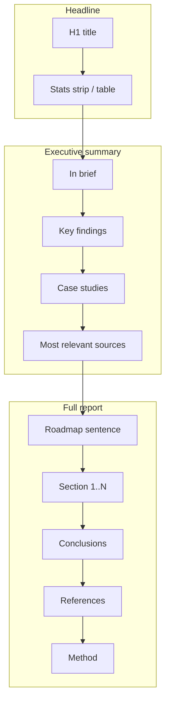
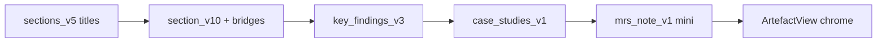

# 034 report iterate — KF, hierarchy, MRS, case studies

Owner pins 2026-09-01: case studies **implement now**; MRS one-liner **in** (reverses “why this source matters” out) but **grounded + cheap** (`gpt-5.4-mini`); authors **parked** with UI/API placeholders; KF double-cite + hierarchy as discussed.

This amends the approved 034 contract in-slice (public interface + prompt bumps). Record the reversal in `contract.md` / `deferred.md` / ADR before merge.

## Current → intended page shape

## 1) Key findings — one citation chip per bullet

**Cause:** [`renderLeadColonBullet`](frontend/src/views/ArtefactView.tsx) slices a colon-crossing citation claim into two `ClaimSpan`s; each paints `[n]`.

**Fix (display-only):** add `showCitationMarker` to `ClaimSpan`; when rendering the lead half, suppress the marker if that claim also appears in the rest half. Markdown already emits one marker — leave it.

**Tests:** extend ArtefactView / lead-colon tests with a crossing citation span → exactly one `[n]` after the warrant.

## 2) Hierarchy / structure

### Frontend chrome ([`ArtefactView.tsx`](frontend/src/views/ArtefactView.tsx), contents, markdown)

- **Headline:** H1 + existing metadata strip (Sources / Published / Last updated) presented as the report stats block.
- **Part label “Executive summary”** wrapping: In brief → Key findings → Case studies → Most relevant sources.
- **Part label “Full report”** wrapping: roadmap → body sections → Conclusions → References → Method.
- Contents grouped to match (Executive summary · Full report themes · Conclusions · References · Method).
- Markdown/print parity in [`artefactPresentation.ts`](frontend/src/views/artefactPresentation.ts).

### Synthesis adjustments

| Piece | Approach | Why |
|---|---|---|
| Roadmap before Section 1 | **Deterministic** one sentence from the proposed body titles (e.g. “The full report then covers A; B; and C.”). Emit as connective prose on the first body section **or** a tiny presentation-only line above the first disclosure — prefer presentation-only so claim spans stay clean. | Cheap, stable, no new LLM call |
| Bridges between sections | Prompt bump `synthesise_section_v9` → **v10**: when not the first body section, allow **at most one** bridging sentence from the previous section’s theme into this takeaway; still P1-first after the bridge; no fake mid-section headers. Conclusions focus keeps “what this amounts to”. | Soft “where appropriate”; lives in section prose |
| Case studies / KF order | Unchanged production pattern: case studies after KF (late produce / early show). | Matches contract S4 |

No new schema. Shared voice block stays; only the section writer gains the bridge clause.

## 3) Most relevant sources

### UI (now)

- One card per row (`grid-cols-1`, full measure) — drop `sm:grid-cols-2`.
- Reuse existing [`AppraisalChip`](frontend/src/views/ArtefactView.tsx) tooltip/hover for strength (already has tier copy); MRS currently uses plain `Chip`.
- Remove “In {sections}” / `citedInSections` from cards and markdown.
- **Authors placeholder:** render slot reserved (`authors?: string[] | null`); when null/empty, omit the line. No acquire/projection work this slice.

### Grounded cheap note (contract reversal)

- After synthesise has the artefact + citations, compute top-3 (same ranking as [`mostRelevantSources`](frontend/src/views/artefactPresentation.ts)).
- For each source, seed = title + appraisal + evidence type + **verbatim cited claim texts / quotes from that source only**.
- New mini surface `most_relevant_note_v1` on **`gpt-5.4-mini`** (same class as judge/search mini; env override optional `POLICY_ATLAS_MRS_NOTE_MODEL`). Structured one-sentence output; must restate only supplied evidence (no free-form importance theatre). Fail-soft: omit note, never fail the run.
- Persist under existing JSONB (no migration): e.g. `synthesis_result.counts["most_relevant_notes"] = [{source_id, note}]`.
- Additive public field on [`ArtefactOut`](backend/src/policy_atlas/api/contract/read_models.py): `most_relevant_notes: list[{source_id, note}]` (default `[]`). Frontend merges into cards. OpenAPI sync.
- Update contract § S5 + discharge the deferred “why this source matters” entry as **narrowed** (grounded note landed; free-form importance still out).

## 4) Case studies — implement Phase B

Follow approved contract § S4 / plan Phase B (no redesign of grain):

- Lead: `synthesise_case_studies_v1` prompt (programme cards: place — instrument; mechanism + one bolded result; cite chips; strength/design/since from DB meta).
- Wire: `CaseStudyWire` + validator (2–4 or 0; exactly-one result; drop failing cards; absence reasons).
- Composition after key findings; `role: "case_studies"` on `synthesis_result.blocks`; `result_ordinal` → `result_claim_id` at projection.
- Public: additive `SectionRole` + `SectionOut.cards` / `CaseStudyCardOut`; `make openapi-sync`; `web-api.md` flow-back.
- Frontend: cards in Executive summary after KF (title, prose with bold result span, cites, strength/design/year chips); markdown parity; absent = omit section.
- ADR **0033** (or next free number if 033 orgs took it — check at build): case-studies late-produce / early-show + S6 overview reversal + this hierarchy amendment.

Prototype examples (UK levy / Mexico / Chile) are the **language grain**, not facts to hardcode.

## Synthesis impact summary

- Prompt bumps: section **v10** (bridges); new **case_studies_v1**; new **most_relevant_note_v1** (mini model).
- KF prompt unchanged for this round (display fix only).
- Roadmap sentence: no LLM.
- Replay via existing private driver after landing; eyeball hierarchy, MRS notes, case cards.

## Out / parked

- Paper **authors** acquire + projection (placeholder only).
- Free-form ungated “why this matters”.
- Venue/year on MRS still out unless already joinable without a new projection fight — do not widen beyond note + authors placeholder.
- Full `make verify` exit + review stack remain Phase F / conversation C.

## Verification focus

- KF: one `[n]` per bullet (UI test).
- Hierarchy: part labels + contents + markdown order tests.
- MRS: full-width; no cited-in; appraisal hover; note present/absent paths; authors slot hidden when empty.
- Case studies: composition/absence/role/result-binding/SSE-untouched; old artefacts `cards: []`.
- Contract/deferred/ADR amendments checked in.