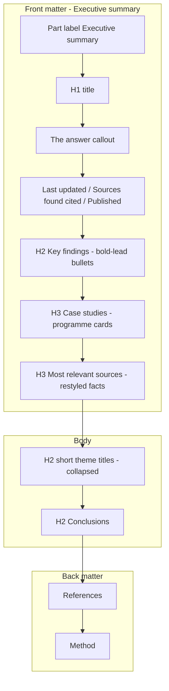

# Task 034 — synthesis report language and presentation

Design conversation A. Contract not drafted until you confirm this kickoff. Build is a later conversation.

## Design sources (how to read them)

Three artefacts, different jobs:

- **[completed-run.html](/Users/karlis.kanders/Downloads/nesta-policy-atlas-prototype-main/completed-run.html) Results tab** — page order, cards, contents, bold-lead bullets, case-study grain. Picture of intent, not a contract. Invented copy is not a backend requirement until the contract says so (032 rule).
- **Pasted “good” sample** — **language target**. Do not clone its childhood-obesity facts, section list, or extra header density.
- **Pasted “current” sample** — **anti-target**. Same question family, current writer voice.

The prototype still **does not** have a working heading hierarchy (Key findings, Most relevant sources, and body sections are all 24px `h2`; Case studies is a smaller `h3`). 034 must go **past** the prototype on heading levels.

**Owner pins, 2026-08-26:** no Authors line; no confidence rating; Most relevant sources = **restyle and move**, no “why this study matters” pass, keep today’s ranking.

## Branching

Stacked on `task/033-ux-snags` → `task/034-synthesis-report`. Folder `docs/tasks/034-synthesis-report/`. PR re-targets `dev` once 033 merges.

## Page shape (Results tab, as-built vs intended)

Today ([`ArtefactView.tsx`](frontend/src/views/ArtefactView.tsx)): eyebrow “Evidence base” → H1 → answer (no “THE ANSWER” label) → 4-cell snapshot (cited/included, study types, years, last updated) → **every synthesis section as the same `h2`** → Most cited sources **after** the body → References → How the evidence was gathered.

Intended front matter (from the HTML, minus Authors/confidence):

1. Part label **Executive summary** (contents first item `#answer`).
2. H1 title.
3. **Answer callout** — existing verified artefact summary, restyled with a **softer label** (“In brief” / “Summary” — exact word pinned at contract). **Fork A settled (owner, 2026-08-26):** not “The answer” — the spec’s citation-free-navigation rule stands, no spec flow-back needed. Still faithfulness-checked, no confidence line.
4. Metadata: Last updated · Sources · Published years. Drop Authors. **Fork B settled (owner, 2026-08-26):** keep 031’s included-based wording (“M cited out of K included”) — restyle only, no count-meaning change. Study types drop from the strip (they live under Method).
5. **Key findings** — always open. Each bullet is `**Lead phrase:** rest of claim` plus cite chip. Gap bullets use a distinct marker (prototype gold).
6. **Case studies** — 2–4 programme cards **before** the body.
7. **Most relevant sources** — same top-3 ranking as today; restyled as cards (title, appraisal chip, type/venue/year). No why-sentence. Move above the body.

Body: ordinary sections collapsed on their one-line summary; **on-page heading is the short name** (today’s `nav_label` grain: Schools, Implementation), not the long analytical title. Conclusions stays last synthesis section. References unchanged. “How the evidence was gathered” **relabel Method** in contents (page heading can match).

## Numbered defects (contract will use these)

- **S1 — Page order.** Front matter (answer, key findings, case studies, most relevant) then body then back matter.
- **S2 — Heading hierarchy.** Part label vs H2 vs H3 as in the diagram. Contents grouped: Executive summary · short theme labels · Conclusions · References · Method. The prototype’s flat 24px stack is **not** the target.
- **S3 — Key-findings parseability.** Bold lead before the first colon; one idea per bullet. Renderer splits on the first `: ` (display-only — claim spans still anchor into the stored prose); a bullet with no colon renders whole and unbolded, never mis-split. **Fork C settled (owner, 2026-08-26): gap bullets are in** — the pass extends to carry gap-typed claims (a succinct overview of the evidence base’s gaps), each with its coverage base like section gap claims, rendered with the distinct marker. Cap (1–2 bullets) pinned at contract so gaps season the block rather than take it over.
- **S4 — Case studies.** New synthesis pass. Discharge the 032 parked seam, but the **grain is programmes** (place — instrument), not IOF finding-rows. Card: title, one-line mechanism, **one bolded result**, cite chip, appraisal badge, design · since year.
- **S5 — Most relevant sources.** Move up and restyle. Ranking and facts-only rule **unchanged**.
- **S6 — Short headings.** `synthesise_sections` writes short titles; stop proposing a “What the evidence shows about…” overview that restates the answer. Named reversal: the answer-shaped overview lead was deliberately added in 028 strand 12 — the front matter now does its framing job; the contract says so explicitly. Consumers of `title` (anchors, duplicate-rejection, `FORBIDDEN_SECTION_TITLES` — note “findings”/“summary” are banned words, so one-word titles need care — chat context, `artefactMarkdown`) are swept; old artefacts keep long titles and render fine (no backfill).
- **S7 — Voice.** Writer, key findings, conclusions, and artefact summary follow the language principles below.
- **S8 — Bold in cards.** Case-study result span is bold (prompt marks it; renderer styles it). Body sections stay flowing prose — no fake H2s inside a section (current writer rule).
- **S9 — Download/print.** Markdown/print follow the same order, short headings, bold leads, and case-study cards.

**Out:** Authors; confidence line; “why this source matters”; mobile; full briefing page; eval harness; backfill of old artefacts; inventing study-level importance.

## Language principles (prompt doctrine for this slice)

Do not overfit the obesity sample. Encode **principles**, with that sample as one illustration. Keep the standing invariants: evidence-descriptive (no recommendations), under-claim, pipeline vocabulary stays out, claims stay exact substrings of prose.

**P1 — Claim, then warrant.** Lead with the finding. Number, population, and source follow. Bad: “prior reviews found most evaluated prevention studies in primary schools, and meta-analyses report statistically significant but small BMI reductions…”. Good: “School programmes move behaviour, not BMI. The two largest UK trials found no BMI difference at 24 months.”

**P2 — Name the world, not the reading of the files.** Ban corpus-touring: “a high-level reading of the documents”, “in the material read here”, “the appraised text”, “across the documents”, “this body of work”, “strand in its own right”, “Inference:”. Write about programmes, populations, and outcomes.

**P3 — One idea per sentence; one headline per bullet.** No stacking three reviews into one sentence. If a second fact is needed, a second sentence.

**P4 — Contrast is the argument.** Structure by what differs (outcome vs behaviour, mechanism vs weight, UK vs comparator, who completed vs who was reached), not by cataloguing every setting the search touched.

**P5 — Scannable handle.** Every key-finding bullet starts with a short lead (about 4–8 words) then a colon, then the warrant. The lead is a claim, not a topic label (“The levy worked on sugar”, not “Fiscal measures”).

**P6 — Numbers do work.** State a figure once, where it decides something. Do not tour counts, mixes, and certainty bands as the paragraph’s spine.

**P7 — Caveats attach to the claim.** They do not replace it. “Looks promising — evaluations are young” is fine. “The documents leave unanswered whether…” as the whole point is not.

**P8 — Still descriptive.** No “should adopt X”. Synthesis of what the evidence amounts to is required (especially conclusions). “The mechanism is settled; the outcome is not” is in bounds; “so ministers should tax Y” is not.

**P9 — Titles name the theme.** Short, parallel, contents-ready. Not a restatement of the user’s question and not a list of intervention types.

Illustration of P5 on the renderer: prototype `keyFindings()` splits `text` on the first `:` and wraps the lead in `<b>`. 034 should do the same rather than storing two fields, unless a colon inside the warrant becomes a real problem.

## Prompt surfaces (lead-authored; version-bump each)

Shared principles P1–P8 go in a **short common voice block** copied into each surface (prompting doctrine: one instruction, one place — if the block would drift, keep it in one module constant). Then each surface adds form rules.

| Surface | Now | 034 | What changes |
|---|---|---|---|
| `synthesise_key_findings_v2` | Takeaway-first `- ` bullets, 3–7, 60–180 words | **v3** | P5 lead-colon form; gap-typed bullets in (Fork C — carry coverage base; capped); shorter warrants; still 3–7 bullets total |
| `synthesise_section_v8` | Takeaway-first 150–450 words; already bans pipeline words | **v9** | P1–P4, P6–P8; extend the banned list with corpus-touring; keep no-bullets/no-headers **inside** a body section |
| `synthesise_sections_v4` | Coherent list + `nav_label` + optional overview lead | **v5** | P9: `title` is the short heading (nav-length); drop overview-that-restates-the-answer; `nav_label` may equal title |
| `summariser_v1` | 2–4 sentences, ≤500 chars, no citations | **v2** | P1–P2 for The answer; still no citations, still no confidence, still faithfulness-judged |
| **New** `synthesise_case_studies_v1` | — | **v1** | After key findings; 2–4 programme cards from verified claims + cited sources; structured wire (title, mechanism, result span, citations); strength/meta filled from appraisal/classify where present, omitted honestly if not |
| Conclusions | Same section writer | covered by **v9** | Extra one-liner in the conclusions focus: “what this amounts to”, not a catalogue of settings visited |
| Block summaries | First-sentence / summariser | inherit | No extra surface if v9 openings are already the takeaway |

**Case-study grain (S4):** named intervention or programme a policy reader can point at (country/system — instrument), each with one result. Not “the three most-cited papers” (that is S5) and not a dumped IOF row. Absence is allowed: mint no block when the claims do not support two distinct programmes (same pattern as key-findings absence).

Hard gates: every row above is a prompt bump. S4 likely needs an additive `SectionRole` (`case_studies`) and `SectionOut` shape — public interface. Prefer riding `synthesis_result.blocks` over a new table. No new runtime egress.

## Renderer notes (frontend)

- Bold-lead: split key-findings lines on first `: `; gold/distinct bullet when the lead is the gap phrase (pin the exact phrase in the contract, e.g. starts with `Main evidence gap`).
- Case-study result: render the marked result span as bold (claim span or a dedicated field — decide at contract; dedicated field is simpler than overloading claim types).
- Contents: prepend Executive summary; use short titles; rename gathered → Method.
- Most relevant: card chrome + chips; keep citation-count ranking in [`mostRelevantSources`](frontend/src/views/artefactPresentation.ts).
- Download path in [`artefactPresentation.ts`](frontend/src/views/artefactPresentation.ts) / [`ArtefactDownload.tsx`](frontend/src/views/ArtefactDownload.tsx) must match S9.

## Risk, verification, next step

**Tier 3.** Prompt-bearing + likely additive public section role. ADR if we add a role or change production/presentation rules (case studies produced late, shown in front matter — same pattern as key findings).

**Review-stack shape (contract must record it):** Tier 3 standard includes contract- and plan-stage adversarial review via `codex-rescue`, but the Codex CLI is not installed — 031/032/033 all recorded the waiver explicitly. 034 makes the same owner decision at the contract 🛑, never inherits it silently.

**Build pre-requisite — a live model route.** Every prompt bump needs the refine-replay loop and the live check needs a real run; AGENTS.md records staging’s OpenAI quota exhausted (blocked 031’s and 033’s browser checks). Quota top-up (or another route) is confirmed **before conversation B opens**, else the slice stalls at verification. Named as a stop condition in the contract.

**Close-out:** deferred.md § Task lifecycle IA case-studies seam recorded discharged; `web-api.md` § Read models gains the new role. No spec flow-back needed (Fork A kept the softer label).

**Forks settled (owner, 2026-08-26):** A — softer callout label, spec stands. B — included-based count wording stays (031 ruling holds). C — gap bullets in key findings, gap-typed with coverage base, capped.

**Next:** freeze the HTML as a design source → branch → draft `contract.md` + `rubric.md` with S1–S9 → 🛑. Then plan. Then stop.
