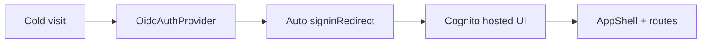
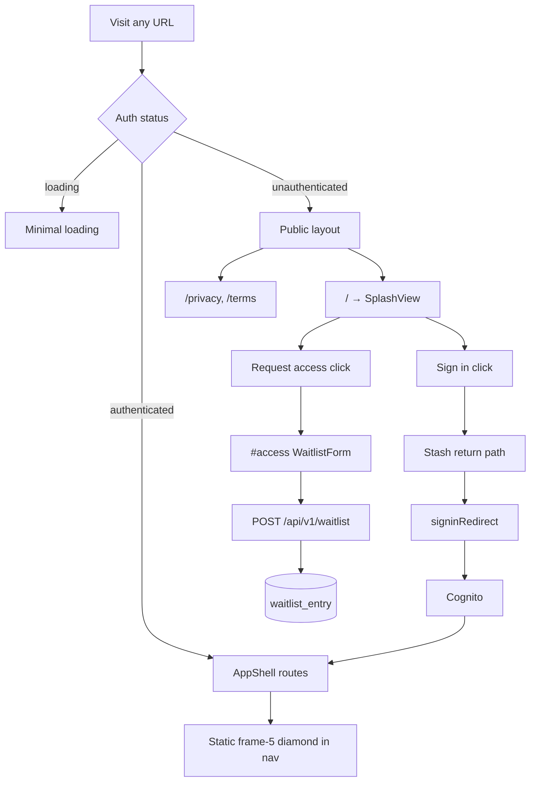

# Splash page and fold-mark branding

## Goal

Logged-out visitors land on a marketing splash page (from [`/Users/karlis.kanders/Downloads/splash-page.html`](file:///Users/karlis.kanders/Downloads/splash-page.html)) instead of being auto-redirected to Cognito. **Sign in** triggers the existing OIDC flow. **Request access** scrolls to `#access` and submits a waitlist form (email, name, organisation optional, role/reason). Authenticated users keep today's app at `/` (tasks list). The app nav gets a static **frame 5** blue diamond logo (all corners folded, 0° — `[ALL, 0, BLUE]` in the prototype's `FRAMES` array, index 4).

## Current state (what we're changing)



Today [`frontend/src/auth/OidcAuthProvider.tsx`](frontend/src/auth/OidcAuthProvider.tsx) **never mounts the router** for unauthenticated users — it auto-redirects and shows "Taking you to sign in…". The nav wordmark in [`frontend/src/ui/brand/Nav.tsx`](frontend/src/ui/brand/Nav.tsx) is text-only. There is **no waitlist table** and **no public write API** — every `/api/v1/*` route requires auth except `/healthz` and `/readyz`.

## Target architecture



### Auth seam changes

Refactor [`OidcAuthProvider.tsx`](frontend/src/auth/OidcAuthProvider.tsx) so it **always** provides `AuthContext` once OIDC loading finishes:

| Behaviour | Today | After |
|-----------|-------|-------|
| Cold visit, no session | Auto `signinRedirect` | Render children; router shows splash |
| Explicit sign-in | N/A (auto) | `auth.signIn()` → stash `sessionStorage` key `policy-atlas.auth-return-to` → `signinRedirect` |
| Mid-session 401 | `onUnauthenticated()` → redirect | **Unchanged** — still redirect (not splash) |
| OIDC error (stale callback) | Alert + manual retry | **Unchanged** |
| Post-login return | `onSigninCallback` restores stashed path | **Unchanged** |

Update [`OidcAuthProvider.test.tsx`](frontend/src/auth/OidcAuthProvider.test.tsx): replace the "cold visit auto-redirects" test with "cold visit renders children without redirecting"; add test that `signIn()` stashes path and calls redirect.

Align [`DevTokenAuthProvider.tsx`](frontend/src/auth/DevTokenAuthProvider.tsx): always render children; unauthenticated dev users also see splash at `/` with **Sign in** revealing the existing [`DevTokenLoginPanel`](frontend/src/auth/DevTokenLoginPanel.tsx) (inline below hero CTAs or anchored at `#access` — prefer inline panel in the access section so the waitlist form stays visible).

### Routing

Restructure [`frontend/src/routes.tsx`](frontend/src/routes.tsx) into two layouts:

1. **Public layout** (no `AppShell`, navy background) — accessible when `auth.status !== 'authenticated'`:
   - `/` → `SplashView`
   - `/privacy`, `/terms` → existing legal views (move out of `AppShell` so they work logged-out)

2. **Protected layout** (`AppShell`) — wrapped in a small `RequireAuth` guard:
   - All current task/project routes
   - On unauthenticated access: stash `pathname + search + hash` in `policy-atlas.auth-return-to`, `<Navigate to="/" replace />`

3. **Authenticated home** — `/` inside protected layout → `TasksListView` (unchanged empty-home redirect to `/new`).

Use a top-level route switch (or conditional route tree in `App.tsx`) keyed on `auth.status === 'authenticated'` so `/` resolves correctly in each mode without duplicate path conflicts.

## Waitlist backend (Request access)

This is the **first public write endpoint** in the API. It requires a schema migration, contract update, conformance-test allowlist change, and a brief security note in the PR (email PII, abuse surface).

### Table: `waitlist_entry`

Add to [`backend/src/policy_atlas/core/schema.py`](backend/src/policy_atlas/core/schema.py) and a new Alembic revision (follow `{12hex}_waitlist_entry.py` naming; template: [`c4e8a2b1d9f3_portfolio_membership.py`](backend/alembic/versions/c4e8a2b1d9f3_portfolio_membership.py)):

| Column | Type | Notes |
|--------|------|-------|
| `entry_id` | `UUID` PK | server-generated |
| `email` | `TEXT` NOT NULL | unique (`uq_waitlist_entry_email`) |
| `name` | `TEXT` NOT NULL | display name |
| `organisation` | `TEXT` NULL | optional |
| `role_or_reason` | `TEXT` NOT NULL | free-text: role / why they want access |
| `created_at` | `TIMESTAMPTZ` NOT NULL | UTC, set on insert |

No link to `app_user` or Cognito — ops enrolment remains the deliberate on-ramp (033 contract). The waitlist is intake only.

### API: `POST /api/v1/waitlist`

New router [`backend/src/policy_atlas/api/routers/waitlist.py`](backend/src/policy_atlas/api/routers/waitlist.py):

- **No** `Depends(get_current_user)` on the router
- Body: `WaitlistSignup` — `email` (`EmailStr`), `name` (required, max length), `organisation` (optional), `role_or_reason` (required, max length)
- Response: `201` + `WaitlistSignupOut` (`entry_id`, `email`, `created_at` — omit org/reason from response to minimise leakage in logs)
- Duplicate email → `409` with `ErrorEnvelope` code `already_registered` (idempotent UX: show "You're already on the list")
- Validation errors → existing `422 validation_error` shape

Contract in [`backend/src/policy_atlas/api/contract/waitlist.py`](backend/src/policy_atlas/api/contract/waitlist.py); re-export from [`contract/__init__.py`](backend/src/policy_atlas/api/contract/__init__.py).

Register router in [`backend/src/policy_atlas/api/app.py`](backend/src/policy_atlas/api/app.py).

Update [`backend/tests/api/test_api_conformance.py`](backend/tests/api/test_api_conformance.py) — add `POST /api/v1/waitlist` to the unauthenticated allowlist (or a dedicated public-routes test).

Tests:
- [`backend/tests/core/test_schema.py`](backend/tests/core/test_schema.py) — migration roundtrip
- New `backend/tests/api/test_waitlist.py` — happy path, duplicate 409, validation 422, no bearer required

Regenerate OpenAPI: `make openapi` → [`frontend/openapi.json`](frontend/openapi.json) + [`frontend/src/api/gen/types.ts`](frontend/src/api/gen/types.ts).

**Abuse / privacy (document in PR, defer heavy controls):**
- No rate-limit middleware exists today — note as known gap; optional follow-up (IP bucket or WAF rule)
- Email is PII — aligns with PrivacyView claims; no admin read API in this slice (ops query DB directly)

## Fold-mark logo module (shared asset)

**Do not commit the 556 KB bundled HTML.** Extract the geometry script from the prototype (identical copy already embedded in [`docs/specs/sources/synthesis-report-ux/completed-run-prototype.html`](docs/specs/sources/synthesis-report-ux/completed-run-prototype.html)).

Create [`frontend/src/ui/brand/foldMark.ts`](frontend/src/ui/brand/foldMark.ts) — pure TypeScript port of:

- Constants: `H`, `FRAMES` (36 frames), palette (`BLUE = var(--color-blue)` / `#0000ff`, `SAND`, `TEAL`, etc.)
- Functions: `framePaths(n, deg?, reverse?)`, `pathsAt(clock, reverse)`, fold interpolation helpers (`silhouette`, `flaps`, `toPath`, `ease`)

Add unit tests in [`frontend/src/ui/brand/foldMark.test.ts`](frontend/src/ui/brand/foldMark.test.ts):

- Frame 5 (index 4) produces a single filled diamond path
- `pathsAt` is deterministic at fixed clock values
- Snapshot or golden-string for frame-5 SVG path `d` attribute (guards regression)

### Static nav logo — frame 5

Create [`frontend/src/ui/brand/FoldMarkIcon.tsx`](frontend/src/ui/brand/FoldMarkIcon.tsx):

```tsx
// frame index 4 = prototype "frame 5": all corners folded, 0°, blue
// reverse = white on light surfaces (nav is bg-paper)
<FoldMarkIcon frame={4} size={26} reverse="#ffffff" />
```

Update [`NavHomeLink`](frontend/src/ui/brand/Nav.tsx): prepend `FoldMarkIcon` before the wordmark (keep "Policy Atlas" text + BETA chip). Match prototype spacing (`gap-2` ≈ 7px).

Optional follow-up (not in initial scope): update [`frontend/public/favicon.svg`](frontend/public/favicon.svg) to the same diamond.

### Animated splash field

Create [`frontend/src/ui/brand/FoldMarkAnimated.tsx`](frontend/src/ui/brand/FoldMarkAnimated.tsx) + [`frontend/src/views/splash/SplashField.tsx`](frontend/src/views/splash/SplashField.tsx):

Port the prototype's constellation logic:

- ~10 positioned sheets with phase offsets (`spread`, `foldSpeed` props — use prototype defaults: `foldSpeed ≈ 0.4`, `spread ≈ 1`)
- `requestAnimationFrame` loop calling `pathsAt(now + offset)` per sheet
- Render each sheet as an absolutely positioned SVG (`viewBox="-115 -115 230 230"`) inside a full-bleed `#splash-field` container
- **`prefers-reduced-motion: reduce`**: freeze all sheets at frame 5 (static diamond constellation) — consistent with existing motion budget in [`index.css`](frontend/src/index.css)

Header mini-mark in splash uses the same animation engine with key `"fold"` and zero offset (as in prototype header).

## Splash page UI

Create [`frontend/src/views/splash/SplashView.tsx`](frontend/src/views/splash/SplashView.tsx) — React + Tailwind, mapping prototype inline styles to existing tokens:

| Prototype | App token / component |
|-----------|----------------------|
| `#0F294A` background | `bg-navy` |
| `#B6E3E8` accent | `text-aqua` / custom if needed |
| `#c8d6e6` body on dark | muted on navy (add `--color-navy-muted: #c8d6e6` to `@theme` if no match) |
| Hero CTA cutout | existing `cutout` utility + white fill |
| Archivo headings | `font-display` (Zosia/Archivo stack already configured) |

**Sections to port:**

1. **Header** — animated mini fold-mark + wordmark; "Request access" → `#access`
2. **Hero** — `SplashField` background + headline/subcopy + CTAs ("Request access" primary white cutout → `#access`; "Sign in" outline → Cognito)
3. **Feature grid** — six numbered sections (01–06) with screenshot placeholders (keep dashed boxes as in prototype)
4. **`#access` — Request access form** (white band, as in prototype layout):
   - Heading: **Request access**
   - Subcopy: short line that we'll review requests and be in touch
   - Fields: email, name, organisation (optional), role/reason (textarea)
   - Submit → `POST /api/v1/waitlist` via generated client or thin `fetch` (no auth header)
   - Success state: confirmation message; disable re-submit briefly
   - Error states: validation inline; 409 → friendly "already on the list"
   - Dev/mock: wire [`frontend/src/mock/api.ts`](frontend/src/mock/api.ts) when `VITE_MOCK=1`
5. **`#links` — placeholder footer** (below `#access`, navy or muted band):
   - Heading: **More from Nesta** (or similar)
   - Dashed placeholder grid: *"Partner logos and links (blog, nesta.org.uk, roadmap) — coming soon"*
   - Do **not** import the bundled PNG logos from the HTML manifest

**Sign in handler:**

```tsx
const auth = useAuth();
const onSignIn = () => {
  sessionStorage.setItem(AUTH_RETURN_TO_KEY, returnPath ?? "/");
  auth.signIn();
};
```

Wire hero "Sign in" outline button and any header sign-in affordance to this.

Extract form into [`frontend/src/views/splash/WaitlistForm.tsx`](frontend/src/views/splash/WaitlistForm.tsx) + tests.

## Copy source of truth

Add [`docs/specs/sources/splash-page/splash-page.html`](docs/specs/sources/splash-page/splash-page.html) — copy the user's prototype into the repo as the design reference (same pattern as synthesis-report-ux prototypes). The React implementation is the runtime source; the HTML is golden reference only.

Patch [`docs/specs/system/web-api.md`](docs/specs/system/web-api.md) with a short § Waitlist describing the public POST (fields, 409 semantics, no admin list in v1).

## Files touched (summary)

| Action | File |
|--------|------|
| New | `backend/alembic/versions/{hex}_waitlist_entry.py` |
| New | `backend/src/policy_atlas/api/contract/waitlist.py`, `api/routers/waitlist.py`, `tests/api/test_waitlist.py` |
| Edit | `backend/src/policy_atlas/core/schema.py`, `api/app.py`, `contract/__init__.py`, `tests/api/test_api_conformance.py`, `tests/core/test_schema.py` |
| New | `frontend/src/ui/brand/foldMark.ts`, `foldMark.test.ts`, `FoldMarkIcon.tsx`, `FoldMarkAnimated.tsx` |
| New | `frontend/src/views/splash/SplashView.tsx`, `SplashField.tsx`, `WaitlistForm.tsx`, `SplashView.test.tsx` |
| New | `frontend/src/routes/RequireAuth.tsx`, `PublicLayout.tsx` |
| Edit | `frontend/src/routes.tsx`, `auth/OidcAuthProvider.tsx`, `DevTokenAuthProvider.tsx`, `mock/api.ts` |
| Edit | `frontend/src/ui/brand/Nav.tsx`, `openapi.json`, `api/gen/types.ts` |
| Edit | `frontend/src/index.css` (navy-muted token if needed) |
| Add | `docs/specs/sources/splash-page/splash-page.html`, `docs/specs/system/web-api.md` § Waitlist |

## Verification

- `make verify` — backend tests (waitlist route + migration roundtrip), frontend tests, openapi drift
- `pnpm --dir frontend test` — foldMark, splash, WaitlistForm, OidcAuthProvider, Nav
- Manual: logged-out `/` → fill waitlist form → 201 + confirmation; duplicate email → 409 message
- Manual OIDC: Sign in opens Cognito; return lands on tasks
- Manual dev-token: Sign in reveals token panel; waitlist works against real or mock API
- Deep link `/projects/:id` logged-out → redirect to splash; after sign-in → return to project
- `prefers-reduced-motion` — animation frozen

## Out of scope (explicit)

- Trusted-by partner logos and external links (`#links` placeholder only)
- Admin UI or API to list/export waitlist entries (ops use DB)
- Rate limiting / CAPTCHA (document as follow-up)
- Auto-enrolment from waitlist → Cognito
- Favicon update (optional follow-up)
- Full task-cycle contract unless you want this numbered as a new slice

## Risk notes

- **Auth regression** — the 026 cold-visit gate existed because tokenless shell queries 401'd forever. Mitigation: `RequireAuth` on all app routes; never mount `AppShell` without authentication.
- **Public POST abuse** — first unauthenticated write; duplicate-email constraint limits replay harm; rate limiting deferred.
- **PII** — waitlist stores email + name; PR should note privacy alignment (no new admin read path).
- **Tier** — schema migration + new public API pushes this to **Tier 2–3** if run through task cycle (migration + security review recommended).
